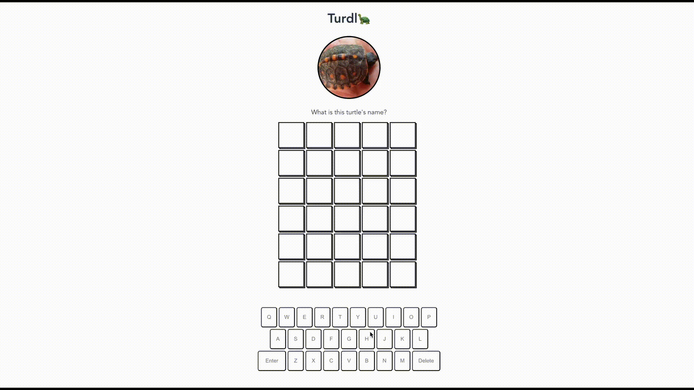

# Turdl

## Project setup
```
npm install
```

### Compiles and hot-reloads for development
```
npm run serve
```

### Compiles and minifies for production
```
npm run build
```

### Lints and fixes files
```
npm run lint
```

### Customize configuration
See [Configuration Reference](https://cli.vuejs.org/config/).


EDIT: Was formally Turdle but now is Turdl. 

You used to be able to play Turdl at https://turdl.io/, however, it is no longer up:(.

This is my own Wordle clone that I made as a fun side project and it is built entirely on the front-end using the VueJs framework and localStorage for caching (but now that you know that, don't cheat! :) ).

**Turdl Demo**



